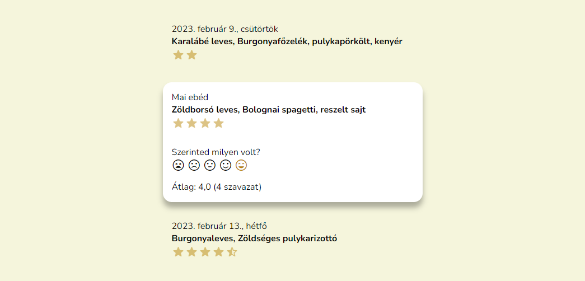

[*Ha Eötvösös vagy kattints ide!*](README_hu.md)

# Menza

Blazor app that displays the school lunch menu and lets you rate it.



The backend is an ASP.NET Core Web API that stores and serves the menus and ratings. It extracts the menu from the school's lunch system automatically.

The frontend is a hosted Blazor WebAssembly app.

## Running locally

```powershell
# Install the .NET 7 SDK. Instructions for other platforms can be found at https://learn.microsoft.com/dotnet/core/install
winget install Microsoft.DotNet.SDK.7

git clone https://github.com/albi005/Menza.git
cd Menza
dotnet run --project Menza.Server
```

The app should now be reachable at http://localhost:7180.

The logic for loading the menus is in the [`Menza.Server/UpdateService.cs`](Menza.Server/UpdateService.cs) file.

There is email filtering when signing up, which can be removed or updated in [`Menza.Server/AuthService.cs`](Menza.Server/AuthService.cs) and [`Menza.Client/AuthService.cs`](Menza.Client/AuthService.cs).
